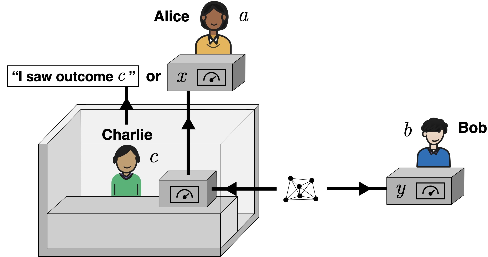

# Agent-Like Observers in Extended Wigner's Friend Scenarios on Quantum Computers

This repository contains the code and data for my master's thesis project,
"Agent-Like Observers in Extended Wigner's Friend Scenarios on Quantum
Computers".

The project implements Extended Wigner's Friend Scenario (EWFS) circuits on
quantum computers. Different agent-like observers are used to represent the
friend Charlie in the experiment, and the resulting data is evaluated through
Local Friendliness (LF) violations and agent-performance plots.



The main pipeline is:

1. Circuit construction
2. Noiseless (ideal) simulation
3. Transpilation of circuits for IBM backends
4. Noise simulation
5. IBM hardware runs
6. Evaluation of LF violations and agent behavior

## Project Structure

```bash
.
├── data/                             
│   ├── IBM_calibrations/             # saved IBM calibration data
│   ├── data_fake_hardware/           # generated fake-hardware simulation runs
│   ├── data_noiseless_simulation/    # generated noiseless simulation runs
│   ├── data_real_hardware/           # generated IBM hardware runs
│   └── paperdata/                    # saved runs used in the thesis
├── ewfs/
│   ├── analysis/
│   │   ├── agent_evaluation.py       # creates thesis plots from data
│   │   ├── lf_violations.py          # LF correlator and violation calculations
│   │   ├── plot_ibm_connectivity.py  # IBM connectivity/layout plots
│   │   └── time_ordering_hardware.py # hardware scheduler timing plots
│   ├── circuits/
│   │   ├── accuracy_test_circuits.py # relaxed LF accuracy-test circuits
│   │   └── agents.py                 # builds agent quantum circuits
│   └── experiments/
│       ├── fake_hardware.py          # noise-simulation script
│       ├── ibm_transpilation.py      # transpilation for IBM backends
│       ├── noiseless_simulation.py   # noiseless simulator script
│       ├── real_hardware.py          # real IBM hardware runs
│       └── run.py                    # main experiment runner
├── notebooks/                        
│   ├── project_demo.ipynb            # demo notebook for the project pipeline
│   └── project_plots.ipynb           # notebook for reproducing thesis plots
├── results/                          # generated after running experiment
└── scripts/
    ├── evaluation.py                 # main file for evaluation plots
    └── run_experiment.py             # main file for running experiments
```

## Installation

Use Python 3.10. Newer Python versions may give dependency problems.
Clone the repository and install the requirements in a virtual environment.

```bash
git clone https://github.com/lauxj/agent-like-observers-ewfs.git
cd agent-like-observers-ewfs
python3.10 -m venv .venv
source .venv/bin/activate
python --version  # should show Python 3.10.x
python -m pip install --upgrade pip
python -m pip install -r requirements.txt
```

On Windows, activate the environment with:

```bash
.venv\Scripts\activate
```

Using VS Code: A simple installation with VS Code would be to download the repository as a ZIP file, store it locally and then open it in VS Code. In the Terminal in VS Code, run the bash command above from the 3rd line.
To run the notebook, choose the installed `.venv` kernel in VS Code.

## Usage

To open the demo notebook via Terminal:

```bash
python -m notebook notebooks/project_demo.ipynb
```

The thesis plots can be reproduced from the saved `data/paperdata/` runs with
`notebooks/project_plots.ipynb` or `scripts/evaluation.py`.

To make a new experiment run, open `scripts/run_experiment.py`, change the
settings near the top, and run the file. The more detailed settings are in
`ewfs/experiments/run.py`.

New runs are saved in the normal data folders:

- `data/data_noiseless_simulation/`
- `data/data_fake_hardware/`
- `data/data_real_hardware/`

For new data, you can change the evaluation script or plots notebook to use
runs from the normal data folders.

An IBM Quantum API token is required for real hardware runs, transpilation
(to access backend calibration data), fake-hardware simulation, and the demo
notebook. Noiseless simulation and evaluation from saved data do not need an
IBM account.


## IBM Quantum API Token

For real hardware runs, and for loading IBM backends, you need access to IBM
Quantum. IBM offers free accounts, with 10 minutes of runtime per month offered.

1. Create a free IBM Quantum account at `https://quantum.cloud.ibm.com/`.
2. Log in to the IBM Quantum Platform.
3. Create or copy an IBM Cloud API key from your account/API key settings.
4. Save the API key locally with Qiskit:

```bash
python -c "from qiskit_ibm_runtime import QiskitRuntimeService; QiskitRuntimeService.save_account(channel='ibm_quantum_platform', token='YOUR_IBM_API_KEY', set_as_default=True, overwrite=True)"
```

Replace `YOUR_IBM_API_KEY` with your IBM Quantum API key. You only need to do
this once. After that, Qiskit can load IBM backends from this project.

## License

This project is licensed under the MIT License. See `LICENSE` for details.
